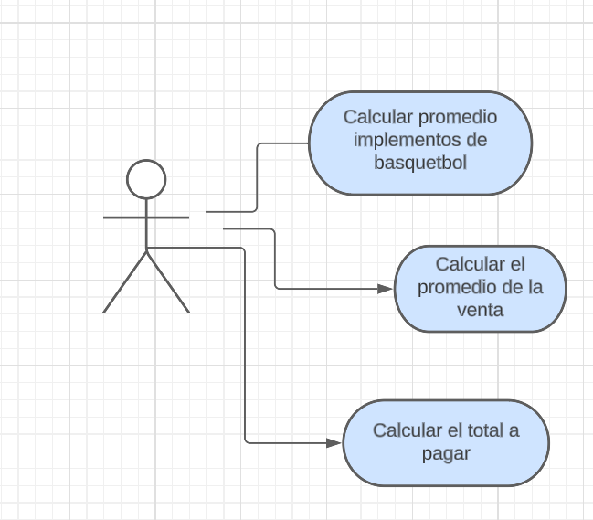
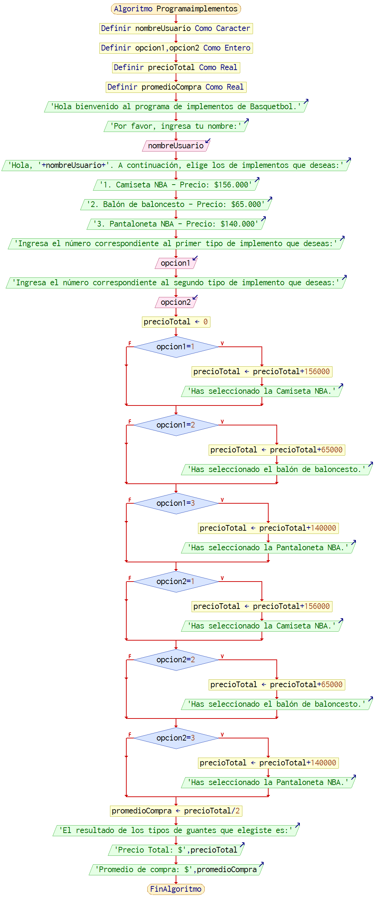

# ejercicio base por Juan Bonilla
De acuerdo con su rango de *programador de software* lo han elegido para el desarrollo de una aplicación que necesita un dueño de implementos de Basquetbol, desea tener una venta clara y basica de sus implementos con tres tipos de implementos diferentes para vender.
<br>
<br>
<br>
Se necesitara una  lista de implementos que estan a la venta y el precio de esos implementos.

*Aclaraciones:*

* Se necesitara que se enumere el tipo de implemento de basquetbol que se vaya a comprar de los 3 tipos que hay.

* Se aclara un mensaje en el que diga que tipo de de implemento de basquetbol  fue comprado y el precio del implemento.
<br>

## Análisis del Ejercicio:
### Aproximación Plantilla Historia de Usuario:

 


## Aproximación Caso de Uso:
 

## Descripcion caso de uso:

Nombre del caso de uso: Selección de implementos de basquetbol

Actores: Usuario

Propósito: Permitir al usuario seleccionar los implementos de basquetbol que desea comprar y conocer el precio total de la compra y el promedio de compra por implemento.

Curso normal de eventos:

1. El usuario inicia el programa.
2. El programa muestra un mensaje de bienvenida y solicita al usuario que ingrese su nombre.
3. El usuario ingresa su nombre.
4. El programa muestra un menú con los implementos disponibles y sus precios.
5. El usuario selecciona el primer implemento y lo agrega al carrito.
6. El usuario selecciona el segundo implemento y lo agrega al carrito.
7. El programa calcula el precio total de la compra y el promedio de compra por implemento.
8. El programa muestra al usuario el precio total de la compra y el promedio de compra por implemento.
9. El programa pregunta al usuario si desea realizar otra compra.


## Diagrama de flujo:
 
<br>
 Implementa un programa que permite al usuario seleccionar implementos de baloncesto y calcular el precio total y el promedio de compra de los implementos elegidos.

Primero, el programa solicita al usuario que ingrese su nombre y luego muestra tres opciones de implementos para elegir: camiseta NBA, balón de baloncesto y pantaloneta NBA.

Luego, el usuario elige dos implementos y el programa calcula el precio total sumando los precios de los implementos seleccionados. A continuación, el programa calcula el promedio de compra dividiendo el precio total por dos (ya que el usuario selecciona dos implementos).

Finalmente, el programa muestra el precio total y el promedio de compra al usuario.

## Aproximación Seudocódigo:
```
Algoritmo Programaimplementos

	Definir nombreUsuario Como Caracter
	Definir opcion1,opcion2 Como Entero
	Definir precioTotal Como Real
	Definir promedioCompra Como Real
	Escribir 'Hola bienvenido al programa de implementos de Basquetbol.'
	Escribir 'Por favor, ingresa tu nombre:'
	Leer nombreUsuario
	Escribir 'Hola, '+nombreUsuario+'. A continuación, elige los de implementos que deseas:'
	Escribir '1. Camiseta NBA - Precio: $156.000'
	Escribir '2. Balón de baloncesto - Precio: $65.000'
	Escribir '3. Pantaloneta NBA - Precio: $140.000'
	Escribir 'Ingresa el número correspondiente al primer tipo de implemento que deseas:'
	Leer opcion1
	Escribir 'Ingresa el número correspondiente al segundo tipo de implemento que deseas:'
	Leer opcion2
	precioTotal <- 0
	Si opcion1=1 Entonces
		precioTotal <- precioTotal+156000
		Escribir 'Has seleccionado la Camiseta NBA.'
	FinSi
	Si opcion1=2 Entonces
		precioTotal <- precioTotal+65000
		Escribir 'Has seleccionado el balón de baloncesto.'
	FinSi
	Si opcion1=3 Entonces
		precioTotal <- precioTotal+140000
		Escribir 'Has seleccionado la Pantaloneta NBA.'
	FinSi
	Si opcion2=1 Entonces
		precioTotal <- precioTotal+156000
		Escribir 'Has seleccionado la Camiseta NBA.'
	FinSi
	Si opcion2=2 Entonces
		precioTotal <- precioTotal+65000
		Escribir 'Has seleccionado el balón de baloncesto.'
	FinSi
	Si opcion2=3 Entonces
		precioTotal <- precioTotal+140000
		Escribir 'Has seleccionado la Pantaloneta NBA.'
	FinSi
	promedioCompra <- precioTotal/2
	Escribir 'El resultado de los tipos de guantes que elegiste es:'
	Escribir 'Precio Total: $',precioTotal
	Escribir 'Promedio de compra: $',promedioCompra
FinAlgoritmo
```


